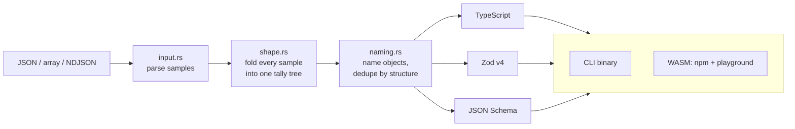

# 🧩 shapesmith

[](https://github.com/ardazeybek-dev/shapesmith/actions/workflows/ci.yml)
[](https://www.npmjs.com/package/shapesmith)
[](https://ardazeybek-dev.github.io/shapesmith/)

Paste a few JSON samples, get the types they share: **TypeScript interfaces, Zod v4 schemas and
JSON Schema (2020-12)**. The engine is written in Rust and runs natively as a CLI, in Node, and in
the browser through WebAssembly.

**Try it:** [ardazeybek-dev.github.io/shapesmith](https://ardazeybek-dev.github.io/shapesmith/). It runs
entirely in the page, so your JSON is never uploaded.

```ts
// three order samples in, this out:
export interface Order {
  id: number;
  status: "paid" | "pending";      // repeated values become a literal union
  /** format: date-time */
  createdAt: string;               // z.iso.datetime() in Zod, "format" in JSON Schema
  shipping: Shipping;
  billing: Shipping;               // identical shapes share one named type
  items: Item[];
  /** present in 2 of 3 samples */
  coupon?: string | null;          // missing in some samples → optional, null seen → nullable
}
```

## Why another JSON-to-types tool

One sample tells you very little: every field looks required and every string looks like a
`string`. shapesmith is built around **many samples**. It folds every sample into one tally per
position (how often a field was present, null, a number, a string…) and emits types from that
evidence:

- a field missing from some samples becomes **optional**, and the doc comment says how often it appeared
- `null` seen anywhere makes the field **nullable**; mixed kinds become a **union**
- strings that are *all* dates, date-times, emails, UUIDs or URLs get a **format**
- a string with a few values that repeat becomes an **enum** (`"paid" | "pending"`)
- integers stay `z.int()` / `"integer"` unless a fraction, or a number JavaScript can't hold exactly, shows up
- nested objects get names from their keys (`items` → `Item`), and structurally identical ones are **deduplicated**

### The guarantee: every sample passes its own schema

Inference is only useful if the output accepts the data it came from. That is tested, not assumed:
the WebAssembly package is fed realistic fixtures **and thousands of random JSON documents generated by
[fast-check](https://fast-check.dev/)**, and every sample must pass the generated schema in the real
**Zod**, the real **ajv**, and TypeScript's own compiler (`tsc --strict`).

That property test has already paid for itself. It found that a sample *without* an optional
`constructor` key was rejected by Zod, because Zod reads `input["constructor"]` and gets the
function inherited from `Object.prototype`. Generated Zod now copies such objects onto a
null-prototype object first. It only does this when an optional field is named after an inherited
member.

## 🛠 Tech Stack

| Layer            | Technology                                                      |
|------------------|-----------------------------------------------------------------|
| Core             | Rust 2024 (`serde_json`, `indexmap`), no regex engine           |
| Browser / Node   | WebAssembly via `wasm-bindgen` + `wasm-pack`, one npm package for both |
| Playground       | Vanilla JS + CSS, no framework, deployed to GitHub Pages        |
| Tests            | `cargo test`, Node test runner, fast-check, Zod 4, ajv 8, TypeScript 7 |
| CI / releases    | GitHub Actions: Linux, macOS and Windows matrix, Pages deploy, binaries on tag |

## 🏗 How it works



- **Tally, not type.** A `Shape` counts what was seen at a position (`seen`, `null`, `integer`,
  `float`, string stats, array items, object fields). Adding a sample only adds to counts, so sample
  order never changes the result, and a field is optional exactly when `field.seen < object.count`.
- **Formats are conservative.** Each detector accepts a strict subset of what Zod and ajv-formats
  accept, so a format is only claimed when the validators will agree.
- **Naming is children-first.** Nested objects are named before their parents; each object's
  signature is built from its fields and its children's names, so identical subtrees collapse to one type.
  Name clashes are qualified by the parent (`PostMeta`).

## 🚀 Usage

### In the browser or Node (npm)

```bash
npm install shapesmith
```

```js
import init, { generate } from "shapesmith";

await init(); // fetches the .wasm in browsers; a no-op in Node

const out = generate(jsonText, { rootName: "Order" });
out.typescript;  // string
out.zod;         // string
out.jsonSchema;  // string
out.samples;     // number of samples read
```

Options (all optional): `rootName`, `detectFormats`, `detectEnums`, `maxEnumValues` (default 8),
`splitTopLevelArrays` (default `true`: a top-level array is a list of samples). Invalid JSON throws
an `Error` whose message includes the line for NDJSON input. CommonJS works too:
`const { generate } = require("shapesmith")`.

### From the command line

Download a binary from [Releases](https://github.com/ardazeybek-dev/shapesmith/releases), or build it:

```bash
cargo install --git https://github.com/ardazeybek-dev/shapesmith

shapesmith orders.json --name order              # TypeScript
curl -s https://api.github.com/events | shapesmith -t zod --name event
shapesmith logs/*.ndjson -t schema > schema.json  # samples from every file are combined
shapesmith --help
```

A release build reads **100,000 NDJSON records (11.8 MB) in about 0.5 s**. The WebAssembly module
is 131 KB (60 KB gzipped).

## 🔧 Development

```bash
cargo test                          # 33 Rust tests: unit, CLI, doc
cargo clippy --all-targets -- -D warnings

npm install -g wasm-pack
node scripts/build-npm.mjs          # builds ./npm (web + node builds)
cd js-tests && npm ci && npm test   # Zod / ajv / tsc round trips + property test
NUM_RUNS=5000 npm test              # more random cases

# playground
wasm-pack build --release --no-pack --target web --out-dir playground/pkg
python -m http.server -d playground 8765
```

## 📁 Project Structure

```
shapesmith/
├── src/
│   ├── lib.rs              # public API: generate(), Options, Output
│   ├── input.rs            # JSON / array-of-samples / NDJSON parsing
│   ├── shape.rs            # the tally tree and enum rules
│   ├── format.rs           # date-time, date, email, uuid, url detectors
│   ├── naming.rs           # type names, singulars, structural dedupe
│   ├── emit/               # typescript.rs, zod.rs, json_schema.rs
│   ├── wasm.rs             # wasm-bindgen bindings (wasm32 only)
│   └── main.rs             # CLI
├── tests/cli.rs            # runs the real binary
├── js-tests/               # the package against Zod, ajv, tsc + fast-check
├── playground/             # static site deployed to GitHub Pages
├── scripts/build-npm.mjs   # assembles the dual browser/Node npm package
└── .github/workflows/      # CI, Pages, Release
```

## ⚖️ Known limitations

- Types describe the samples you gave. Rare values that are missing from the samples won't appear in the types.
- Enum detection is a heuristic (few distinct values, at least one repeated). Turn it off with `--no-enums` / `detectEnums: false`.
- Singular names are English best effort (`Status` → `Statu`); the type is still valid, just rename it.
- TypeScript itself checks a missing optional `constructor`/`toString` against the inherited member, so
  object literals without those keys won't type-check. Zod and JSON Schema are unaffected.

## ⚠️ Pitfalls

- Validating the JSON Schema with ajv in strict mode fails on `"type": ["string", "null"]` or misreads inherited keys → pass `allowUnionTypes: true, ownProperties: true`.
- `wasm-pack build` fails with `Bulk memory operations require bulk memory` → the bundled `wasm-opt` is older than the Rust target; the `--enable-*` flags in `Cargo.toml` fix it.
- Windows + GNU toolchain + a non-ASCII project path: `ld: cannot find …rcgu.o` → set `CARGO_TARGET_DIR` to an ASCII path.
- Node 24 on Windows: `fs.rmSync` / `fs.cpSync` silently do nothing on non-ASCII paths → the build script uses `unlinkSync` / `copyFileSync`.
- `wasm-pack` writes a `*` `.gitignore` into its output → npm then publishes an empty package; check with `npm pack --dry-run`.

## 📄 License

MIT
